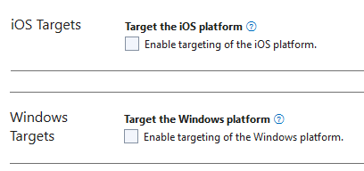

# Dynamsoft Capture Vision samples for MAUI edition

This repository contains multiple samples that demonstrate how to use the [Dynamsoft Capture Vision](https://www.dynamsoft.com/capture-vision/docs/core/introduction/) MAUI Edition.

- [User Guide](https://www.dynamsoft.com/barcode-reader/docs/mobile/programming/maui/user-guide.html)
- [API Reference](https://www.dynamsoft.com/barcode-reader/docs/mobile/programming/maui/api-reference/)

## System Requirements

### .Net

- .NET 7.0 and above.

### Android

- Supported OS: **Android 5.0** (API Level 21) or higher.
- Supported ABI: **armeabi-v7a**, **arm64-v8a**, **x86** and **x86_64**.
- Development Environment: Visual Studio 2022.
- JDK: 1.8+

### iOS

- Supported OS: **iOS 11.0** or higher.
- Supported ABI: **arm64** and **x86_64**.
- Development Environment: Visual Studio 2022 for Mac and Xcode 14.3+.

## Samples

| Sample Name | Description |
| ----------- | ----------- |
| `BarcodeReaderSimpleSample` | This is a sample that illustrates the simplest way to recognize barcodes from video streaming with Dynamsoft Capture Vision MAUI SDK. |

## Installation

### Visual Studio for Mac

In the **NuGet Package Manager>Manage Packages for Solution** of your project, search for **Dynamsoft.BarcodeReaderBundle.Maui**. Select it and click **install**.

### Visual Studio for Windows

You have to Add the library via the project file and do some additional steps to complete the installation.

1. Add the library in the project file:

    ```xml
    <Project Sdk="Microsoft.NET.Sdk">
        ...
        <ItemGroup>
            ...
            <PackageReference Include="Dynamsoft.BarcodeReaderBundle.Maui" Version="10.2.1101" />
        </ItemGroup>
    </Project>
    ```

2. Open the **Package Manager Console** and run the following commands:

    ```bash
    dotnet build
    ```

> Note:
>
> - Windows system have a limitation of 260 characters in the path. If you don't use console to install the package, you will receive error "Could not find a part of the path 'C:\Users\admin\.nuget\packages\dynamsoft.imageprocessing.ios\2.2.300\lib\net7.0-ios16.1\Dynamsoft.ImageProcessing.iOS.resources\DynamsoftImageProcessing.xcframework\ios-arm64\dSYMs\DynamsoftImageProcessing.framework.dSYM\Contents\Resources\DWARF\DynamsoftImageProcessing'"
> - The library only support Android & iOS platform. Be sure that you remove the other platforms like Windows, maccatalyst, etc.

### Build and Run

Select your device and run the project.

> Note:
>
> - Please follow the installation steps above to complete the installation before running the project. Visual Studio for mac will not install the library automatically when you build the project.
> - If you are running Android only on Visual Studio Windows, please mannually exclude iOS and Windows platforms. Otherwise, the Visual Studio will report type or namespace not found errors.



## License

- You can request a 30-day trial license via the [Request a Trial License](https://www.dynamsoft.com/customer/license/trialLicense?product=cvs&utm_source=samples&package=maui) link.

## Contact Us

For any questions or feedback, you can either [contact us](https://www.dynamsoft.com/company/contact/) or [submit an issue](https://github.com/Dynamsoft/capture-vision-maui-samples/issues/new).
